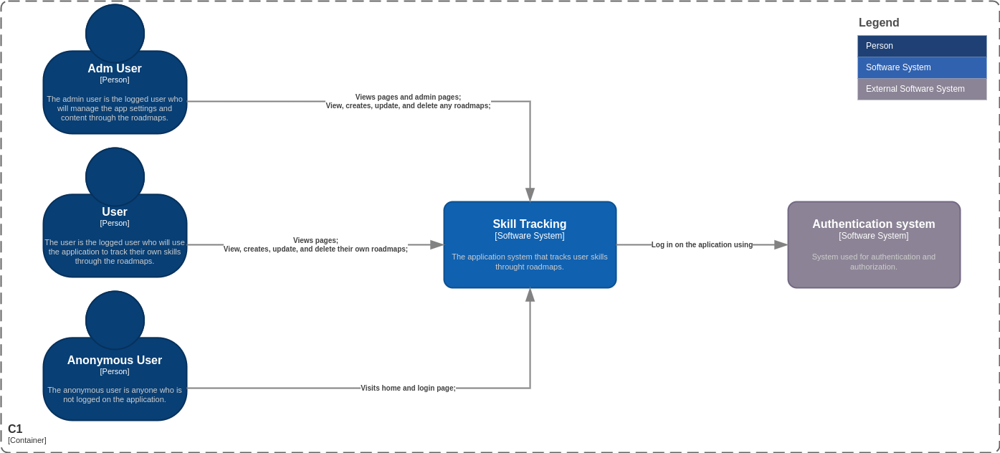

# Skill Tracking C4 Model

The C4 model is a framework for visualizing the architecture of software systems. It consists of four layers, each providing different levels of abstraction and detail.

## Context Diagram

The context diagram provides a high-level view of the system, showing how it interacts with users and other systems. It gives an overview of what the system does without going into implementation details.

## Container Diagram

The container diagram dives a level deeper into the system's architecture, breaking it down into containers which can be applications, data stores, or microservices. This layer describes the technology choices, communication methods, and responsibilities of each container.

## Component Diagram

The component diagram further breaks down the containers into individual components. These are the smallest units of the system that can be deployed independently. The diagram shows how these components interact with each other to fulfill their responsibilities.

## Code Diagram

The code diagram is the most detailed layer of the C4 model. It depicts the internal structure of a single component, showing classes, interfaces, and their relationships. This layer is particularly useful for developers working on the system's implementation.

> [!WARNING]
>
> Creating a code diagram for a complex system can be time-consuming and may become outdated quickly due to the volatile nature of software development. Code changes frequently as features are added, bugs are fixed, or the architecture is refactored. Keeping the code diagram up-to-date would require constant maintenance which might not be feasible or efficient. Instead, focusing on higher-level diagrams like context, container, and component diagrams can provide valuable architectural insights while being less susceptible to frequent changes in the codebase.